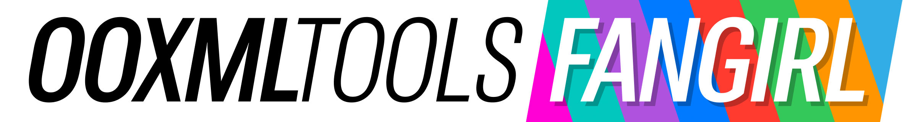

# 

Repo containing design assets for the [`@ooxml-tools`](https://github.com/ooxml-tools) organisation

## Main logo

| Image                                                                                                                                                                                       |
| :------------------------------------------------------------------------------------------------------------------------------------------------------------------------------------------ |
|         |
|     |

## Repo logos

| Image                                                                                                                                                                                                 | Repository                                                                            |
| :---------------------------------------------------------------------------------------------------------------------------------------------------------------------------------------------------- | :------------------------------------------------------------------------------------ |
|                         | [`@ooxml-tools/cli`](https://github.com/ooxml-tools/cli)                              | 
|                     | [`@ooxml-tools/file`](https://github.com/ooxml-tools/file)                            |  
|                         | [`@ooxml-tools/jsx`](https://github.com/ooxml-tools/jsx)                              | 
|             | [`@ooxml-tools/render`](https://github.com/ooxml-tools/render)                        |
|         | [`@ooxml-tools/toolbox`](https://github.com/ooxml-tools/toolbox)                      |
|                 | [`@ooxml-tools/units`](https://github.com/ooxml-tools/units)                          |
|     | [`@ooxml-tools/validate`](https://github.com/ooxml-tools/validate)                    |
|             | [`@ooxml-tools/vscode`](https://github.com/ooxml-tools/vscode)                        |
|             | [`@ooxml-tools/design`](https://github.com/ooxml-tools/design)                        |
|             | [`@ooxml-tools/.github`](https://github.com/ooxml-tools/.github/tree/main/profile)    |

## Stickers

| Image                                                                 |
| :-------------------------------------------------------------------- |
|      |
|   |
|     |

## Fonts & colors
The logo uses [Roboto Flex](https://fonts.google.com/specimen/Roboto+Flex) for its typeface and uses [iOS, iPadOS system colors](https://developer.apple.com/design/human-interface-guidelines/color#iOS-iPadOS-system-colors) as a base