# 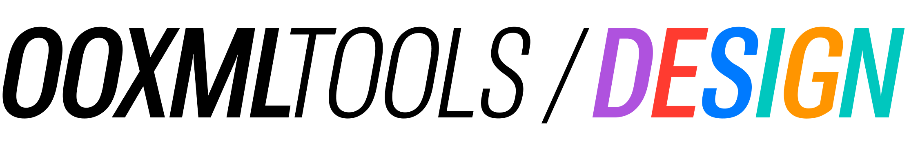

Repo containing design assets for the `@ooxml-tools` org

## Main logo

| Dark                                                                     | Light                                                                     | Org                                                    |
| ------------------------------------------------------------------------ | ------------------------------------------------------------------------- | ------------------------------------------------------ |
| 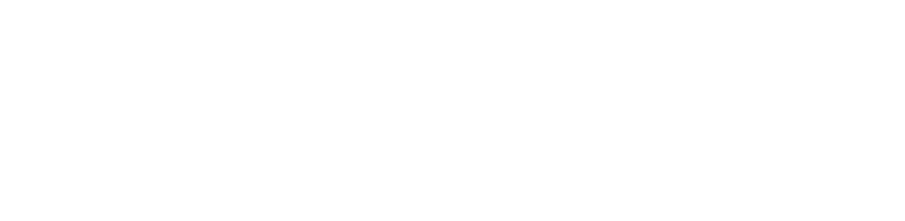  | 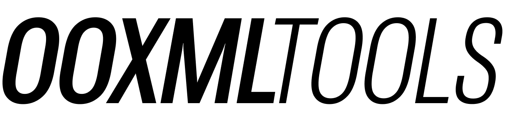  |  [`@ooxml-tools`](https://github.com/ooxml-tools)      | 

## Repo logos
| Dark                                                                            | Light                                                                            | Repo                                                                 |
| ------------------------------------------------------------------------------- | -------------------------------------------------------------------------------- | -------------------------------------------------------------------- |
| 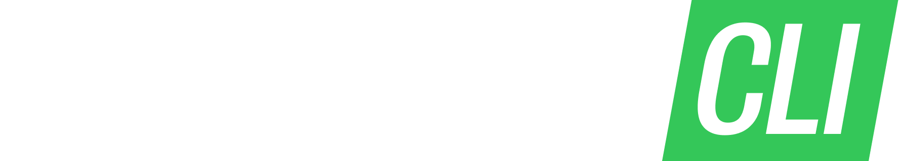            | 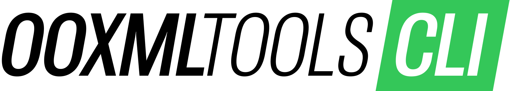            |  [`@ooxml-tools/cli`](https://github.com/ooxml-tools/cli)            | 
| 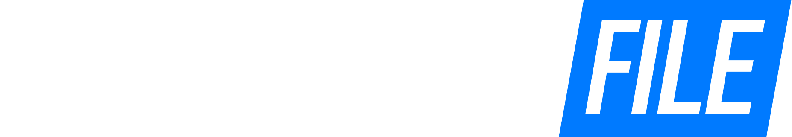          | 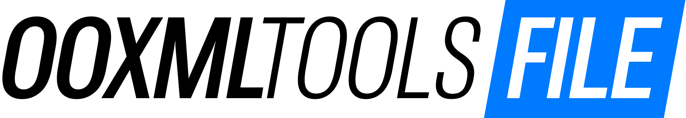          |  [`@ooxml-tools/file`](https://github.com/ooxml-tools/file)          |  
| 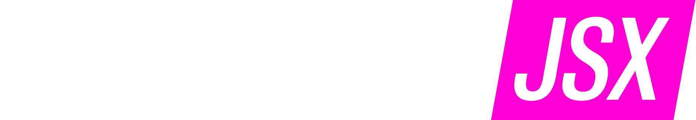            |             |  [`@ooxml-tools/jsx`](https://github.com/ooxml-tools/jsx)            | 
| 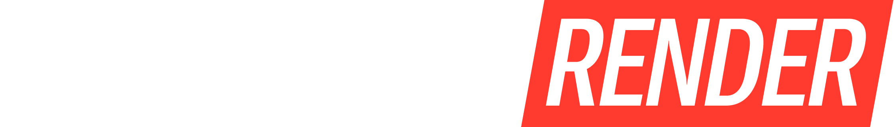      | 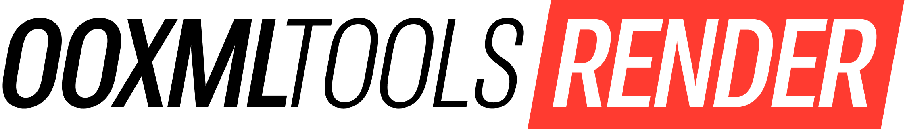      |  [`@ooxml-tools/render`](https://github.com/ooxml-tools/render)      |
| 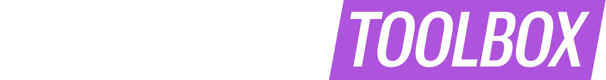    |     |  [`@ooxml-tools/toolbox`](https://github.com/ooxml-tools/toolbox)    |
| 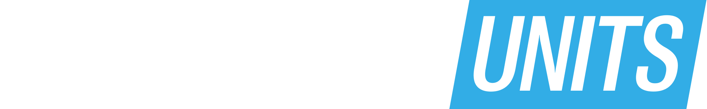        |         |  [`@ooxml-tools/units`](https://github.com/ooxml-tools/units)        |
| 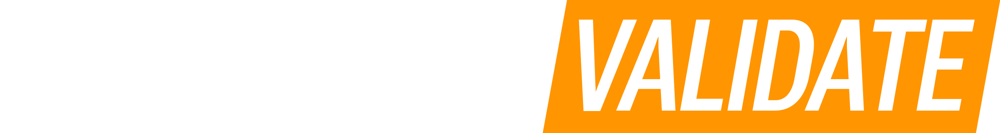  |   |  [`@ooxml-tools/validate`](https://github.com/ooxml-tools/validate)  |
| 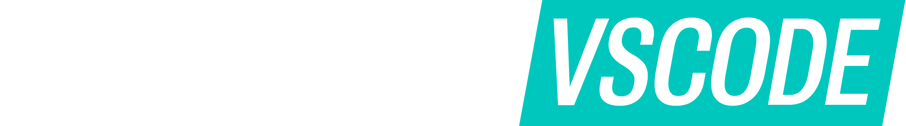      |       |  [`@ooxml-tools/vscode`](https://github.com/ooxml-tools/vscode)      |

## Stickers
Todo...

## Fonts & colors
The logo uses [Roboto Flex](https://fonts.google.com/specimen/Roboto+Flex) for its typeface and uses [iOS, iPadOS system colors](https://developer.apple.com/design/human-interface-guidelines/color#iOS-iPadOS-system-colors) as a base